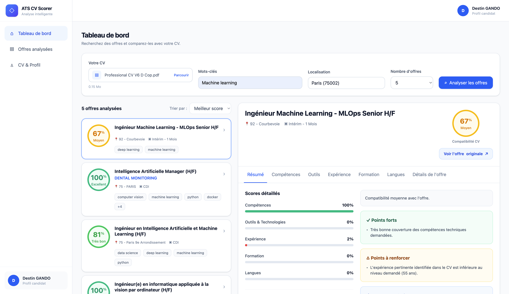
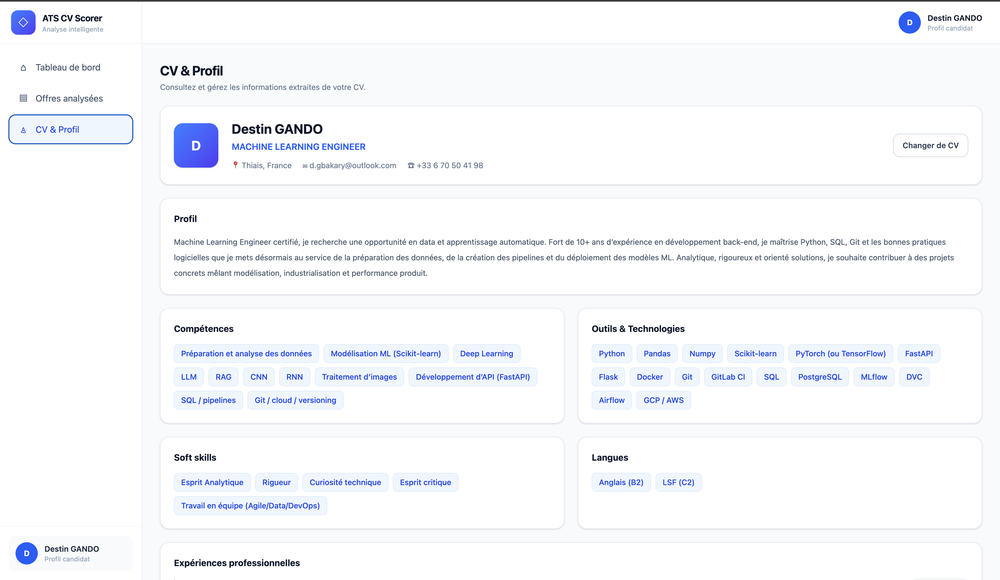
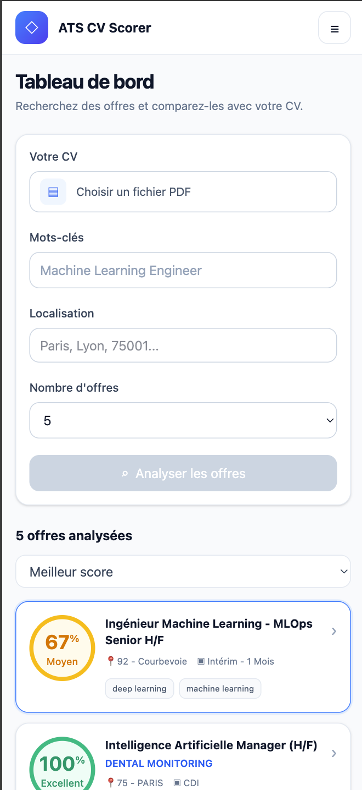

# ATS CV Scorer

Application intelligente d'analyse de CV et de matching avec des offres d'emploi.

ATS CV Scorer permet à un candidat d'importer son CV au format PDF, de rechercher des offres d'emploi et d'obtenir un classement des offres selon leur compatibilité avec son profil.

Le projet combine extraction de données, NLP, recherche sémantique, Large Language Models (LLM) et scoring métier afin de produire un matching détaillé et explicable entre un CV et une offre d'emploi.

**Repository :** [github.com/dgando-bit/ats-cv-scorer_v2](https://github.com/dgando-bit/ats-cv-scorer_v2)

---

## Sommaire

- [Aperçu](#aperçu)
- [Fonctionnalités](#fonctionnalités)
- [Architecture](#architecture)
- [Pipeline de recherche et de matching](#pipeline-de-recherche-et-de-matching)
- [Stack technique](#stack-technique)
- [Prérequis](#prérequis)
- [Installation](#installation)
- [Configuration](#configuration)
- [Lancement avec Docker](#lancement-avec-docker)
- [Développement local](#développement-local)
- [API](#api)
- [Matching](#matching)
- [Performance](#performance)
- [Tests](#tests)
- [Interface utilisateur](#interface-utilisateur)
- [Limites actuelles](#limites-actuelles)
- [Améliorations futures](#améliorations-futures)
- [Sécurité](#sécurité)
- [Statut du projet](#statut-du-projet)

---

# Aperçu

L'objectif d'ATS CV Scorer est de répondre à une question simple :

> **Quelles offres d'emploi correspondent réellement à mon profil ?**

L'application analyse notamment :

- les compétences techniques ;
- les outils et technologies ;
- l'expérience professionnelle ;
- la formation ;
- les langues ;
- les exigences présentes dans les offres d'emploi.

Chaque offre reçoit ensuite un **score de compatibilité avec le CV**, accompagné d'une analyse détaillée.

---

# Fonctionnalités

## Analyse du CV

L'utilisateur peut importer un CV au format PDF.

L'application extrait et structure notamment :

- nom du candidat ;
- titre professionnel ;
- profil ;
- coordonnées ;
- compétences ;
- outils et technologies ;
- soft skills ;
- langues ;
- expériences professionnelles ;
- formations.

Un endpoint dédié permet également d'analyser un CV indépendamment d'une recherche d'offres.

---

## Recherche d'offres d'emploi

L'utilisateur peut rechercher des offres à partir de :

- mots-clés ;
- localisation ;
- nombre d'offres souhaité.

Les offres sont actuellement récupérées via l'API **France Travail**.

L'architecture utilise une abstraction `JobProvider`, ce qui permettra d'intégrer d'autres sources d'offres ultérieurement.

---

## Autocomplétion des localisations

Le formulaire propose une autocomplétion des localisations.

Lorsqu'une ville est sélectionnée, son code INSEE peut être transmis au backend afin d'améliorer la précision de la recherche auprès de France Travail.

---

## Recherche sémantique

Les offres ne sont pas uniquement filtrées à partir de mots-clés.

Un modèle d'embeddings calcule une similarité sémantique entre :

- le métier recherché ;
- le titre de l'offre ;
- la description de l'offre.

Cette étape permet d'identifier rapidement les offres les plus proches de l'intention de recherche.

---

## Re-ranking avec un LLM

Après le filtrage sémantique, les meilleures offres sont réévaluées afin de déterminer leur pertinence réelle par rapport au métier recherché.

Le re-ranking permet notamment de distinguer des métiers sémantiquement proches mais différents.

Exemple :

```text
Recherche :
Backend Developer

Offres candidates :
Frontend Engineer
Software Engineer
Backend Engineer

        ↓

Recherche sémantique

        ↓

Re-ranking LLM

        ↓

Offres réellement pertinentes
```

Le LLM utilisé est actuellement appelé via **Groq**.

---

## Extraction des exigences

Pour les offres finalement sélectionnées, l'application extrait les principales exigences :

- hard skills ;
- outils et technologies ;
- soft skills ;
- langues ;
- expérience requise ;
- formation ;
- responsabilités.

Dans le pipeline interactif actuel, cette étape privilégie une extraction locale afin de réduire fortement la latence et le nombre d'appels LLM.

Un mécanisme de fallback permet également de conserver un résultat exploitable lorsque certaines extractions échouent.

---

## Matching CV / offre

Chaque offre sélectionnée est comparée avec le CV du candidat.

Le moteur calcule plusieurs scores :

- compétences ;
- outils et technologies ;
- expérience ;
- formation ;
- langues.

Ces scores permettent ensuite de produire un score global de compatibilité.

Exemple :

```text
Compatibilité globale : 82 %

Compétences : 90 %
Outils       : 85 %
Expérience   : 75 %
Formation    : 100 %
Langues      : 60 %
```

---

## Analyse de l'expérience pertinente

Le système ne se limite pas à l'ancienneté professionnelle totale.

Il tente d'évaluer l'expérience pertinente par rapport au contexte et aux compétences demandées dans l'offre.

Cela permet d'éviter de considérer automatiquement toutes les années d'expérience du candidat comme pertinentes pour n'importe quel poste.

---

## Explication du matching

Pour chaque offre, l'application fournit :

- un résumé ;
- les points forts ;
- les points à renforcer ;
- des recommandations.

L'utilisateur peut également consulter séparément :

- les compétences correspondantes ;
- les compétences manquantes ;
- les outils maîtrisés ;
- les outils manquants ;
- l'expérience ;
- la formation ;
- les langues ;
- les détails de l'offre.

---

## Accès à l'offre originale

Lorsqu'une URL source est disponible, l'utilisateur peut accéder directement à l'offre d'emploi originale depuis l'interface.

---

## CV & Profil

Une vue dédiée permet de consulter les informations détectées dans le CV :

- identité ;
- profil ;
- compétences ;
- technologies ;
- soft skills ;
- langues ;
- expériences ;
- formations.

L'utilisateur peut également remplacer son CV directement depuis cette vue.

---

## Historique des analyses

Les recherches précédentes sont conservées dans le navigateur.

L'utilisateur peut :

- consulter ses analyses précédentes ;
- rouvrir une analyse ;
- supprimer une analyse ;
- vider complètement l'historique.

Une confirmation est demandée avant les suppressions importantes.

L'historique est actuellement stocké côté frontend.

---

## Interface responsive

L'application est responsive et adaptée aux :

- ordinateurs ;
- tablettes ;
- smartphones.

Sur mobile, la navigation entre la liste des offres et le détail d'une offre utilise une vue dédiée afin de conserver une bonne lisibilité.

---

# Architecture

Le projet est séparé en deux applications principales :

```text
ats-cv-scorer_v2/
│
├── backend/
│   ├── app/
│   ├── scripts/
│   ├── tests/
│   ├── Dockerfile
│   └── pyproject.toml
│
├── frontend/
│   ├── src/
│   ├── public/
│   ├── Dockerfile
│   ├── package.json
│   └── pnpm-lock.yaml
│
├── compose.yaml
├── compose.override.yaml
├── .env
├── .env.example
└── README.md
```

---

## Architecture backend

Le backend est développé avec **FastAPI**.

Structure simplifiée :

```text
backend/
├── app/
│   ├── api/
│   │   ├── routes/
│   │   └── dependencies.py
│   │
│   ├── core/
│   │
│   ├── models/
│   │
│   ├── providers/
│   │
│   └── services/
│       ├── cv/
│       ├── jobs/
│       ├── llm/
│       ├── matching/
│       └── semantic/
│
├── scripts/
├── tests/
├── Dockerfile
└── pyproject.toml
```

Les responsabilités sont séparées entre :

- extraction du CV ;
- récupération des offres ;
- recherche sémantique ;
- évaluation de pertinence ;
- extraction des exigences ;
- matching ;
- génération des explications.

---

## Architecture frontend

Le frontend utilise **React**, **TypeScript**, **Vite** et **Tailwind CSS**.

Structure simplifiée :

```text
frontend/
├── src/
│   ├── api/
│   ├── assets/
│   ├── components/
│   │   ├── dashboard/
│   │   ├── history/
│   │   ├── profile/
│   │   └── ui/
│   ├── types/
│   ├── utils/
│   ├── App.tsx
│   ├── index.css
│   └── main.tsx
│
├── public/
├── Dockerfile
├── package.json
├── pnpm-lock.yaml
└── vite.config.ts
```

---

# Pipeline de recherche et de matching

L'un des objectifs du projet est de limiter les appels coûteux au LLM.

Le pipeline suit donc plusieurs niveaux de filtrage.

```text
                         ┌──────────────────┐
                         │      CV PDF      │
                         └────────┬─────────┘
                                  │
                                  ▼
                         ┌──────────────────┐
                         │ Extraction du CV │
                         └────────┬─────────┘
                                  │
                                  ▼
                         ┌──────────────────┐
                         │   CV structuré   │
                         └────────┬─────────┘
                                  │
                                  │
                                  │
Recherche utilisateur             │
        │                         │
        ▼                         │
┌───────────────────┐             │
│   France Travail  │             │
└─────────┬─────────┘             │
          │                       │
          ▼                       │
┌───────────────────┐             │
│ Offres candidates │             │
└─────────┬─────────┘             │
          │                       │
          ▼                       │
┌───────────────────┐             │
│ Embeddings /      │             │
│ similarité        │             │
│ sémantique        │             │
└─────────┬─────────┘             │
          │                       │
          ▼                       │
┌───────────────────┐             │
│ Top K candidats   │             │
└─────────┬─────────┘             │
          │                       │
          ▼                       │
┌───────────────────┐             │
│ Re-ranking LLM    │             │
│ via Groq          │             │
└─────────┬─────────┘             │
          │                       │
          ▼                       │
┌───────────────────┐             │
│ Sélection finale  │             │
└─────────┬─────────┘             │
          │                       │
          ▼                       │
┌───────────────────┐             │
│ Extraction locale │             │
│ des exigences     │             │
└─────────┬─────────┘             │
          │                       │
          └───────────┬───────────┘
                      │
                      ▼
             ┌───────────────────┐
             │  Matching Engine  │
             └─────────┬─────────┘
                       │
                       ▼
             ┌───────────────────┐
             │ Scores détaillés  │
             └─────────┬─────────┘
                       │
                       ▼
             ┌───────────────────┐
             │   Explications    │
             └───────────────────┘
```

Une configuration typique du pipeline est :

```text
France Travail
      ↓
~50 offres candidates
      ↓
Embeddings / similarité sémantique
      ↓
Top ~20
      ↓
Re-ranking
      ↓
Top N demandé
      ↓
Extraction des exigences
      ↓
Matching CV / offre
```

Les valeurs exactes peuvent varier selon la configuration de l'application.

---

# Stack technique

## Backend

- Python 3.11
- FastAPI
- Pydantic
- Pydantic Settings
- Groq API
- Sentence Transformers / embeddings
- Hugging Face
- pytest
- uv
- Docker

## Frontend

- React
- TypeScript
- Vite
- Tailwind CSS
- pnpm
- Node.js 24

## APIs et services externes

- France Travail API
- Groq API
- Hugging Face Hub

## Infrastructure

- Docker
- Docker Compose

---

# Prérequis

La méthode recommandée pour lancer l'application utilise Docker.

Il faut installer :

- Git ;
- Docker ;
- Docker Compose.

Pour un développement entièrement local sans Docker, il faut également :

### Backend

- Python 3.11+
- uv

### Frontend

- Node.js
- pnpm

---

# Installation

Cloner le repository :

```bash
git clone https://github.com/dgando-bit/ats-cv-scorer_v2.git
cd ats-cv-scorer_v2
```

Créer ensuite le fichier de configuration :

```bash
cp .env.example .env
```

Puis renseigner les credentials nécessaires dans `.env`.

---

# Configuration

Le backend utilise `pydantic-settings` pour charger les variables d'environnement.

Exemple de `.env` :

```env
# ============================================================
# ATS CV Scorer
# ============================================================

# Application
APP_NAME=ATS CV Scorer
MODEL_NAME=oksomu/resume-ner
MAX_FILE_SIZE_MB=10

# France Travail API
FRANCE_TRAVAIL_CLIENT_ID=
FRANCE_TRAVAIL_CLIENT_SECRET=
FRANCE_TRAVAIL_SCOPE=api_offresdemploiv2 o2dsoffre

# Groq
GROQ_API_KEY=
GROQ_MODEL=openai/gpt-oss-20b

# Hugging Face
HF_TOKEN=
```

## Variables d'environnement

| Variable | Description | Obligatoire |
|---|---|---|
| `APP_NAME` | Nom de l'application | Non |
| `MODEL_NAME` | Modèle NER utilisé pour le CV | Non |
| `MAX_FILE_SIZE_MB` | Taille maximale d'un CV PDF | Non |
| `FRANCE_TRAVAIL_CLIENT_ID` | Client ID France Travail | Oui |
| `FRANCE_TRAVAIL_CLIENT_SECRET` | Client Secret France Travail | Oui |
| `FRANCE_TRAVAIL_SCOPE` | Scope API France Travail | Non |
| `GROQ_API_KEY` | Clé API Groq | Oui |
| `GROQ_MODEL` | Modèle utilisé pour le re-ranking | Non |
| `HF_TOKEN` | Token Hugging Face Hub | Non, mais recommandé |

> Ne jamais versionner le fichier `.env` ou des clés API.

---

## Hugging Face

Le backend utilise un modèle provenant de Hugging Face pour certaines opérations NLP/sémantiques.

Sans token Hugging Face, les téléchargements anonymes peuvent fonctionner mais avec des limites plus restrictives.

Un avertissement similaire peut apparaître :

```text
Warning: You are sending unauthenticated requests to the HF Hub.
```

Il est donc recommandé de renseigner :

```env
HF_TOKEN=hf_xxxxxxxxxxxxxxxxx
```

---

# Lancement avec Docker

C'est la méthode recommandée.

Le projet contient deux services :

```text
backend_ats
frontend_ats
```

Ils correspondent aux conteneurs :

```text
ats-backend
ats-frontend
```

## Lancer toute l'application

Depuis la racine :

```bash
docker compose up --build
```

Cette seule commande démarre :

```text
┌─────────────────────────────────────┐
│          ATS CV Scorer              │
├──────────────────┬──────────────────┤
│ Frontend         │ Backend          │
│ React / Vite     │ FastAPI          │
│ :5173            │ :8000            │
└──────────────────┴──────────────────┘
```

L'application est ensuite accessible sur :

```text
Frontend
http://localhost:5173

Backend
http://localhost:8000

Swagger
http://localhost:8000/docs

ReDoc
http://localhost:8000/redoc
```

---

## Mode développement

Le fichier :

```text
compose.override.yaml
```

est automatiquement pris en compte par Docker Compose.

Il active les volumes de développement et le hot reload.

### Backend

Les dossiers suivants sont montés dans le conteneur :

```text
./backend/app     → /app/app
./backend/tests   → /app/tests
./backend/scripts → /app/scripts
./backend/data    → /app/data
```

Uvicorn est lancé avec :

```text
--reload
```

Les modifications Python sont donc automatiquement prises en compte.

### Frontend

Le projet frontend est monté dans le conteneur :

```text
./frontend → /app
```

Vite est lancé avec :

```text
--host 0.0.0.0
```

Les modifications React/TypeScript bénéficient donc également du hot reload.

---

## Lancer en arrière-plan

```bash
docker compose up --build -d
```

---

## Afficher les conteneurs

```bash
docker compose ps
```

---

## Consulter les logs

Tous les services :

```bash
docker compose logs -f
```

Backend uniquement :

```bash
docker compose logs -f backend_ats
```

Frontend uniquement :

```bash
docker compose logs -f frontend_ats
```

Il est également possible d'utiliser les noms des conteneurs :

```bash
docker logs -f ats-backend
```

ou :

```bash
docker logs -f ats-frontend
```

---

## Arrêter l'application

```bash
docker compose down
```

---

## Reconstruire complètement les images

```bash
docker compose down
docker compose build --no-cache
docker compose up
```

---

# Développement local

Docker Compose est recommandé, mais les deux applications peuvent également être exécutées séparément.

---

## Backend en local

Se placer dans :

```bash
cd backend
```

Installer les dépendances :

```bash
uv sync
```

Lancer FastAPI :

```bash
uv run uvicorn app.main:app --reload
```

L'API est disponible sur :

```text
http://localhost:8000
```

Swagger :

```text
http://localhost:8000/docs
```

---

## Frontend en local

Dans un second terminal :

```bash
cd frontend
```

Installer les dépendances :

```bash
pnpm install
```

Lancer Vite :

```bash
pnpm dev
```

L'application est généralement accessible sur :

```text
http://localhost:5173
```

---

## Build frontend

Pour vérifier que le frontend compile correctement :

```bash
cd frontend
pnpm run build
```

Le build est généré dans :

```text
frontend/dist/
```

---

# API

FastAPI fournit une documentation interactive complète sur :

```text
http://localhost:8000/docs
```

---

## Extraction d'un CV

```http
POST /api/cv/extract
```

Entrée :

```text
multipart/form-data
file=<CV.pdf>
```

Exemple de réponse :

```json
{
  "candidate_name": "John Doe",
  "title": "Machine Learning Engineer",
  "profile": "...",
  "contact": {
    "email": "john@example.com",
    "phone": null,
    "location": "Paris",
    "website": null
  },
  "skills": [],
  "tools": [],
  "soft_skills": [],
  "languages": [],
  "experiences": [],
  "education": []
}
```

---

## Recherche et ranking

```http
POST /api/jobs/rank
```

Le pipeline effectue notamment :

1. la récupération du CV ;
2. la recherche des offres ;
3. le retrieval sémantique ;
4. le re-ranking ;
5. l'extraction des exigences ;
6. le matching ;
7. la génération des résultats détaillés.

Exemple simplifié :

```json
{
  "candidate_name": "John Doe",
  "jobs": [
    {
      "job": {
        "title": "Machine Learning Engineer",
        "company": "Example Company",
        "location": "Paris"
      },
      "match": {
        "score": 82,
        "details": {
          "skills": 90,
          "tools": 80,
          "languages": 60,
          "experience": 75,
          "education": 100
        },
        "matched_skills": [],
        "missing_skills": [],
        "matched_tools": [],
        "missing_tools": [],
        "matched_languages": [],
        "missing_languages": []
      },
      "explanation": {
        "summary": "...",
        "strengths": [],
        "weaknesses": [],
        "recommendations": []
      }
    }
  ]
}
```

---

## Recherche de localisations

```http
GET /api/locations/search
```

Exemple :

```text
/api/locations/search?q=par&limit=8
```

Cet endpoint est utilisé par l'autocomplétion du formulaire.

---

# Matching

Le moteur de matching analyse plusieurs dimensions indépendamment.

## Compétences

Les compétences demandées sont comparées avec celles du candidat.

Le résultat distingue notamment :

```text
matched_skills
missing_skills
```

---

## Outils et technologies

Le même principe est appliqué aux technologies :

```text
matched_tools
missing_tools
```

---

## Expérience

L'expérience est évaluée en tenant compte autant que possible de la pertinence des expériences professionnelles par rapport au poste.

---

## Formation

Le niveau de formation demandé est comparé aux formations détectées dans le CV.

---

## Langues

Les langues demandées sont comparées aux langues présentes dans le CV.

Le résultat distingue :

```text
matched_languages
missing_languages
```

---

# Performance

La performance constitue un enjeu important du projet, car les appels aux LLM sont beaucoup plus coûteux qu'un calcul local.

Une implémentation naïve pourrait effectuer :

```text
50 offres
   ↓
50 appels LLM
   ↓
extraction détaillée
   ↓
matching
```

Cette approche augmente fortement :

- la latence ;
- la consommation de tokens ;
- le risque de rate limiting.

ATS CV Scorer utilise donc un pipeline progressif :

```text
Offres France Travail
        ↓
Embeddings
        ↓
Réduction du nombre d'offres
        ↓
Re-ranking
        ↓
Sélection finale
        ↓
Extraction locale
        ↓
Matching
```

Cette architecture réduit significativement le nombre d'opérations coûteuses.

---

## Chargement du modèle sémantique

Le premier appel peut être plus lent lorsque le modèle doit être chargé ou téléchargé.

Une fois chargé, les requêtes suivantes bénéficient du modèle déjà disponible en mémoire/cache.

---

## Rate limiting Groq

Groq peut retourner une erreur HTTP `429` lorsque les limites de tokens sont atteintes.

Exemple :

```text
RateLimitError: 429
rate_limit_exceeded
```

Le pipeline limite donc le nombre d'offres envoyées au LLM et évite autant que possible les appels individuels inutiles.

---

# Tests

Les tests backend utilisent `pytest`.

Depuis :

```bash
cd backend
```

lancer tous les tests :

```bash
uv run pytest
```

Mode détaillé :

```bash
uv run pytest -v
```

---

## Tests du pipeline principal

```bash
uv run pytest \
  tests/test_semantic_similarity_service.py \
  tests/test_job_search_pipeline.py \
  tests/test_jobs_rank_api.py \
  -v
```

Les tests utilisent autant que possible des fakes/mocks afin d'éviter les appels aux APIs externes.

Ils permettent notamment de vérifier :

- la similarité sémantique ;
- le re-ranking ;
- le pipeline de recherche ;
- le respect du nombre final d'offres ;
- l'extraction des exigences ;
- les mécanismes de fallback ;
- le matching ;
- l'API FastAPI ;
- la validation des fichiers PDF.

---

# Interface utilisateur

L'application comporte trois vues principales.

---

## Tableau de bord

Le tableau de bord permet de :

- importer un CV ;
- saisir le métier recherché ;
- choisir une localisation ;
- sélectionner le nombre d'offres ;
- lancer l'analyse ;
- consulter les résultats.

Sur desktop :

```text
┌────────────────────┬─────────────────────────────┐
│                    │                             │
│   Liste offres     │       Détail offre         │
│                    │                             │
│   Offre 1          │   Compatibilité             │
│   Offre 2          │   Compétences               │
│   Offre 3          │   Expérience                │
│   ...              │   Formation                 │
│                    │   Recommandations           │
│                    │                             │
└────────────────────┴─────────────────────────────┘
```

---

## Offres analysées

Cette vue permet de consulter l'historique.

Chaque analyse contient notamment :

- les mots-clés ;
- la localisation ;
- le nombre d'offres ;
- la date ;
- le meilleur score obtenu.

Une analyse peut être rouverte sans relancer la recherche.

---

## CV & Profil

Cette vue présente les données structurées du CV :

```text
Identité
│
├── Profil
├── Compétences
├── Outils & Technologies
├── Soft skills
├── Langues
├── Expériences
└── Formations
```

---

# Responsive design

L'interface est construite avec Tailwind CSS.

Elle est adaptée aux écrans desktop, tablette et mobile.

## Desktop

La liste et le détail d'une offre sont visibles simultanément.

## Mobile

L'interface utilise une navigation séquentielle :

```text
Liste des offres
       ↓
Sélection d'une offre
       ↓
Détail
       ↓
← Retour aux offres
```

Les cartes, tags, boutons et différentes sections sont également adaptés aux petits écrans.

---

# Historique

L'historique est actuellement stocké dans le navigateur.

Cette approche permet :

- une V1 simple ;
- aucune base de données nécessaire ;
- réouverture instantanée d'une analyse ;
- absence de nouvel appel API lors de la consultation.

Cette architecture pourra évoluer vers une persistance serveur avec authentification.

---

# Gestion des erreurs

L'application prévoit plusieurs mécanismes pour éviter qu'une erreur externe bloque toute l'analyse :

- validation des fichiers PDF ;
- validation Pydantic ;
- gestion des erreurs HTTP ;
- gestion des erreurs Groq ;
- fallback lors de certaines extractions ;
- messages d'erreur côté frontend ;
- confirmation avant les suppressions importantes.

---

# Principes d'architecture

## Séparation des responsabilités

Chaque service possède une responsabilité spécifique.

---

## Abstraction des providers

Les offres sont récupérées via une abstraction :

```text
JobProvider
```

L'implémentation actuelle utilise France Travail.

Cette architecture facilite l'ajout futur d'autres providers.

---

## Services LLM isolés

Les appels LLM sont séparés du moteur de matching.

Le moteur métier peut donc être testé sans effectuer de vrais appels Groq.

---

## Fallback

Une défaillance d'un service externe ne doit pas nécessairement empêcher toute l'analyse.

---

## Testabilité

Les principales dépendances peuvent être remplacées par des fakes pendant les tests.

---

# Limites actuelles

Cette version constitue une V1 fonctionnelle.

Certaines limites restent présentes :

- dépendance à plusieurs APIs externes ;
- latence possible des appels LLM ;
- limites de débit Groq ;
- téléchargement initial des modèles Hugging Face ;
- historique uniquement local au navigateur ;
- absence d'authentification ;
- absence de base de données ;
- qualité de l'extraction dépendante de la structure du CV ;
- certaines offres ne précisent pas explicitement leurs exigences ;
- normalisation des compétences encore perfectible ;
- calcul de certaines durées d'expérience perfectible.

---

# Améliorations futures

## Performance

- cache des embeddings ;
- embeddings en batch ;
- cache des offres déjà analysées ;
- cache des résultats France Travail ;
- préchargement des modèles ;
- parallélisation contrôlée ;
- optimisation supplémentaire des appels LLM.

---

## Matching

- pondération configurable ;
- meilleure normalisation des compétences ;
- taxonomie métier plus riche ;
- gestion avancée des synonymes ;
- meilleure estimation de l'expérience ;
- gestion des niveaux linguistiques ;
- prise en compte avancée des certifications.

---

## Fonctionnalités produit

- authentification ;
- comptes utilisateurs ;
- base de données ;
- sauvegarde serveur des CV ;
- historique serveur ;
- favoris ;
- comparaison de plusieurs offres ;
- suivi des candidatures ;
- export PDF d'une analyse.

---

## Intelligence artificielle

- recommandations personnalisées ;
- détection avancée des mots-clés ATS manquants ;
- suggestions pour améliorer le CV ;
- adaptation du CV à une offre ;
- génération d'une lettre de motivation ;
- suggestions de compétences à acquérir ;
- résumé intelligent d'une candidature.

---

## Sources d'offres

Grâce à l'abstraction `JobProvider`, d'autres sources pourront être ajoutées en complément de France Travail.

---

## Infrastructure

Pour une future version de production :

```text
Frontend
   ↓
Build Vite
   ↓
Nginx / CDN

Backend
   ↓
FastAPI
   ↓
Container production
```

Le Dockerfile frontend actuel est principalement destiné au développement avec Vite.

Une image multi-stage pourra être ajoutée pour la production.

---

# Sécurité

Les secrets doivent être stockés exclusivement dans les variables d'environnement.

Ne jamais versionner :

```text
.env
API keys
tokens
credentials
```

Le `.gitignore` doit notamment contenir :

```gitignore
.env
.env.local
.env.*.local
```

Le fichier suivant doit en revanche être versionné :

```text
.env.example
```

Avant de publier le repository, vérifier :

```bash
git status
```

Puis vérifier que `.env` est bien ignoré :

```bash
git check-ignore .env
```

Et que `.env.example` ne l'est pas :

```bash
git check-ignore .env.example
```

---

# Qualité du code

Avant un commit important, il est recommandé d'exécuter les tests backend et le build frontend.

## Backend

```bash
cd backend
uv run pytest
```

## Frontend

```bash
cd frontend
pnpm run build
```

Les deux commandes doivent terminer sans erreur.

---

# Workflow Git

Le projet utilise une organisation basée sur :

```text
main
  ↑
develop
  ↑
feature/*
```

Créer une fonctionnalité :

```bash
git checkout develop
git checkout -b feature/nom-feature
```

Puis :

```bash
git add .
git commit -m "feat: description de la fonctionnalité"
```

Une fois terminée :

```bash
git checkout develop
git merge feature/nom-feature
```

---

# Captures d'écran

Pour présenter le projet sur GitHub, des captures peuvent être ajoutées dans :

```text
docs/screenshots/
```

Exemple :

```markdown






```

Captures recommandées :

1. tableau de bord avec résultats ;
2. détail d'une offre ;
3. onglet compétences ;
4. vue CV & Profil ;
5. historique ;
6. interface mobile.

---

# Statut du projet

**Version actuelle : V1**

## Fonctionnalités terminées

- [x] Upload d'un CV PDF
- [x] Extraction structurée du CV
- [x] Endpoint dédié d'extraction du CV
- [x] Recherche d'offres France Travail
- [x] Autocomplétion des localisations
- [x] Recherche sémantique
- [x] Re-ranking des offres
- [x] Extraction des exigences
- [x] Matching CV / offre
- [x] Scoring détaillé
- [x] Analyse de l'expérience pertinente
- [x] Explication du matching
- [x] Compétences correspondantes/manquantes
- [x] Outils correspondants/manquants
- [x] Langues correspondantes/manquantes
- [x] Accès à l'offre originale
- [x] Historique des analyses
- [x] Confirmation avant suppression
- [x] Vue CV & Profil
- [x] Interface responsive
- [x] Tests backend
- [x] Build frontend
- [x] Dockerisation du backend
- [x] Dockerisation du frontend
- [x] Hot reload backend/frontend avec Docker Compose

## Évolutions prévues

- [ ] Authentification
- [ ] Base de données
- [ ] Historique serveur
- [ ] Sauvegarde des CV
- [ ] Favoris
- [ ] Suivi des candidatures
- [ ] Export PDF
- [ ] Déploiement production

---

# Démarrage rapide

Pour lancer ATS CV Scorer :

```bash
git clone https://github.com/dgando-bit/ats-cv-scorer_v2.git

cd ats-cv-scorer_v2

cp .env.example .env
```

Renseigner ensuite dans `.env` au minimum :

```env
FRANCE_TRAVAIL_CLIENT_ID=...
FRANCE_TRAVAIL_CLIENT_SECRET=...
GROQ_API_KEY=...
```

Puis :

```bash
docker compose up --build
```

Ouvrir :

```text
http://localhost:5173
```

Documentation API :

```text
http://localhost:8000/docs
```

---

# Auteur

Projet développé par **Destin Gando**.

Projet réalisé autour du **Machine Learning Engineering, NLP, LLM, recherche sémantique et développement d'applications Data/IA**.

GitHub : [dgando-bit](https://github.com/dgando-bit)

---

# Licence

Aucune licence open source n'est définie pour le moment.
